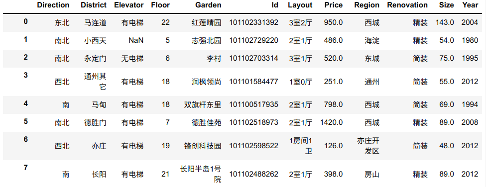

# 房价预测

房屋的价格和所在区域、楼层、房龄等都有密切的关系，现在需求开发一个房价预测的模型，通过训练数据拟合得到房屋的价格。

数据分为：

* 训练数据：`train_data.csv`，共有16573条数据
* 测试数据：`test_data.csv`，共有7104条数据

数据文件为`csv`格式的文本文件，可以使用 `pandas`库读取，具体的数据格式如下图所列：

数据共有12列，分别是：

* `Direction`： 房屋所在城市的方位
* `District`： 区域
* `Elevator`：是否有电梯
* `Floor`： 所在楼层
* `Garden`： 小区名字
* `Id`: 唯一的编号
* `Layout`：几室，几厅
* `Price`： 价格 （需要预测的值）
* `Region`： 所在的区域
* `Renovation`： 房屋装修的类型
* `Size`：房屋面积
* `Year`：建成年份

## 要求

使用自选的方法构建一个回归模型，通过训练数据找到回归模型的参数。利用训练好的模型预测测试数据`test_data.csv`的房价，并和真值比较，计算误差。具体要求：

* 编写回归模型的训练、测试程序
* 详细解释所使用的方法
* 利用训练好的模型将测试数据`test_data.csv`的数据进行预测
* 和真值进行对比，计算平均误差
* 分析模型的问题，提出改进的方案
* 分析结果的效果，综合考虑各种方法，改进方法，并提交结果
* 按照`report_template.ipynb`撰写自己的报告

## 参考

数据来源： https://aistudio.baidu.com/aistudio/datasetdetail/135607

