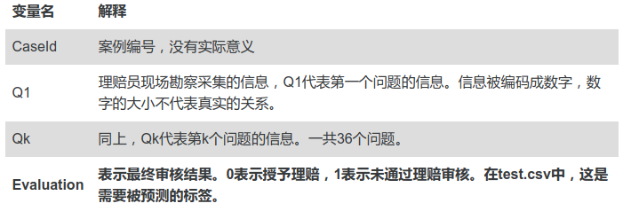

# Report 1 - 交通事故理赔审核预测

在交通摩擦（事故）发生后，理赔员会前往现场勘察、采集信息，这些信息往往影响着车主是否能够得到保险公司的理赔。训练集数据包括理赔人员在现场对该事故方采集的36条信息，信息已经被编码，以及该事故方最终是否获得理赔。我们的任务是根据这36条信息预测该事故方没有被理赔的概率。

* 任务类型：二元分类
* 数据介绍：训练集中共有200000条样本，预测集中有80000条样本。 

* 评价方法：Precision-Recall, AUC

## 要求：

1. 编写程序，初步完成分类
2. 在[竞赛网站](http://sofasofa.io/competition.php?id=2)上注册，提交结果（如果不能提交，则用已有的数据进行验证）
3. 分析结果的效果，综合考虑各种方法，改进方法，并提交结果
4. 按照`report_template.ipynb`撰写自己的报告

## References

* [这个数据的链接](http://sofasofa.io/competition.php?id=2)

